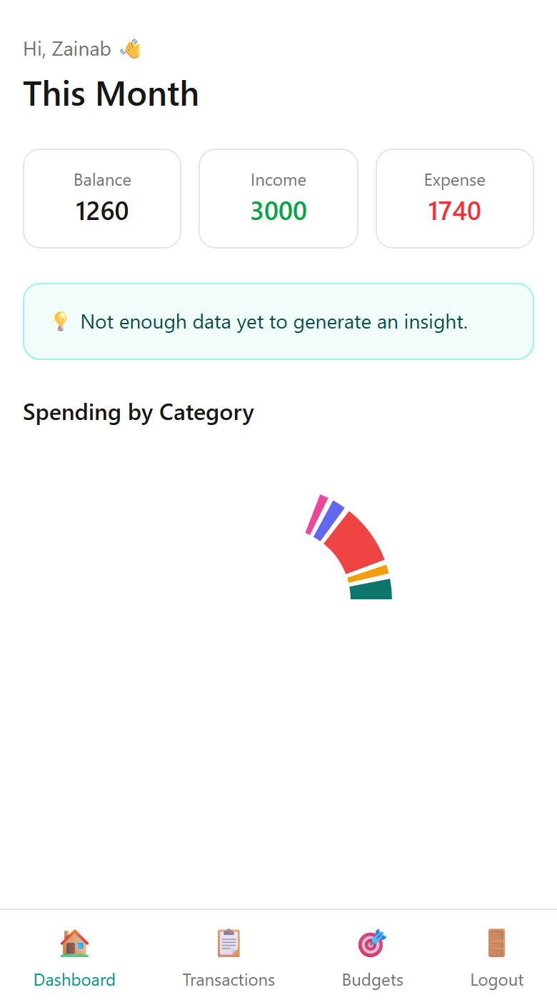
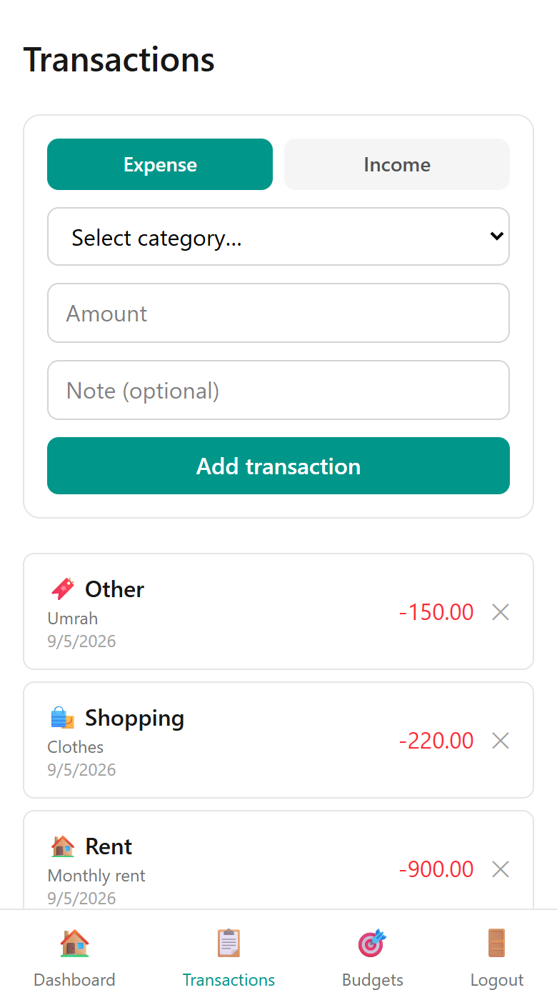
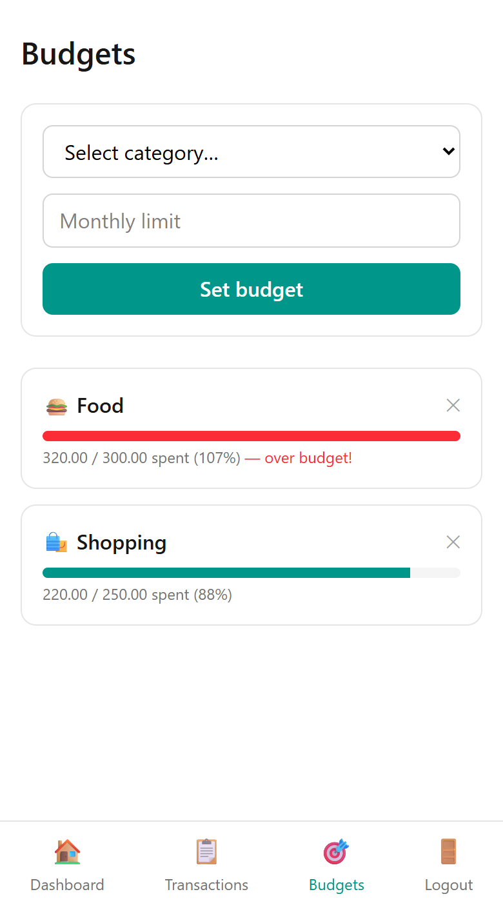

# Finance Tracker

A personal finance tracker that lets you log income/expenses, see spending
analytics, set budgets, and get alerts — built as an installable
**Progressive Web App (PWA)**, so it goes on your phone's home screen like
a native app with no app store required.

<p align="center">
  
  
  
</p>

<p align="center"><i>Real screenshots of the running app — not mockups.</i></p>

## Features

- 🔐 Email/password login (JWT-secured)
- 💸 Log income and expenses, grouped into categories (sensible defaults
  provided automatically — including an **"Other"** catch-all with a
  required note, e.g. *"Umrah"*, for anything that doesn't fit)
- 📊 Dashboard: this month's balance, income, expense, and a spending
  breakdown by category
- 💡 Auto-generated spending insight ("Your Food spending increased 23%
  vs last month")
- 🎯 Budgets per category with over-budget warnings
- 📱 Installable on a phone or laptop — works offline once installed

## Tech Stack

| Layer | Choice |
|---|---|
| Frontend | React + Vite + TypeScript + Tailwind CSS v4, installable PWA |
| Backend | FastAPI (Python) |
| Database | SQLite (dev) / PostgreSQL (production) |
| Auth | JWT (bcrypt password hashing) |
| Charts | Recharts |

---

## For users — installing the app

Once the app is deployed (see **Deployment** below) or running locally,
open its URL in your phone's browser and install it like any other app —
no Play Store or App Store needed:

### Android (Chrome)
1. Open the app's link in Chrome
2. Tap the **⋮** menu → **"Install app"** (or you'll see an "Add to Home
   Screen" banner automatically)
3. Confirm — the icon lands on your home screen and opens full-screen

### iPhone / iPad (Safari)
1. Open the app's link in Safari
2. Tap the **Share** icon → **"Add to Home Screen"**
3. Confirm — opens full-screen with no address bar, just like a native app

### Windows / Mac / Linux (Chrome or Edge)
1. Open the app's link
2. Click the **install icon** (⊕ or a small monitor icon) in the address
   bar — or open the browser's **⋮ menu → "Install Finance Tracker…"**
3. It opens in its own window and appears in your Start Menu / Applications,
   like any other installed app

---

## For developers — running it locally

Requires **Python 3.10+** and **Node.js 18+**.

### 1. Backend

```bash
cd backend
python -m venv .venv
.venv\Scripts\activate          # macOS/Linux: source .venv/bin/activate
pip install -r requirements.txt
copy .env.example .env          # macOS/Linux: cp .env.example .env
uvicorn app.main:app --reload
```
- API: `http://localhost:8000/api`
- Interactive docs: `http://localhost:8000/docs`

### 2. Frontend

In a second terminal:

```bash
cd frontend
npm install
copy .env.example .env          # macOS/Linux: cp .env.example .env
npm run dev
```
Open the printed `http://localhost:5173` URL. Sign up, add a transaction,
set a budget — the dropdown comes pre-filled with default categories
(Food, Transport, Rent, Shopping, Entertainment, Health, Salary, Other…),
so there's nothing extra to configure first.

To test the "install to home screen" flow on an actual phone, connect it
to the same Wi-Fi as your computer and visit
`http://<your-computer's-LAN-IP>:5173`.

### 3. Build for production

```bash
cd frontend
npm run build      # outputs dist/ — includes the PWA service worker + manifest
npm run preview    # serve the production build locally to sanity-check it
```

## Project Structure

```
finance-tracker/
├── backend/     FastAPI REST API — auth, transactions, budgets, analytics
├── frontend/    React PWA client
└── docs/        Screenshots and other docs
```

See `backend/README.md` and `frontend/README.md` for a breakdown of each
side's internal folder structure.

## Deployment

- **Frontend** → any static host with PWA support: Vercel, Netlify, Cloudflare Pages
- **Backend** → Render, Railway, Fly.io (anywhere that runs a FastAPI app)
- **Database** → managed PostgreSQL (Render/Supabase/Railway all offer a free tier)

Point the frontend's `VITE_API_BASE_URL` env var at the deployed backend
URL, and the backend's `DATABASE_URL` at the PostgreSQL connection string.

## Status

🚧 In active development on the `dev` branch. `main` only receives
confirmed, working merges.
